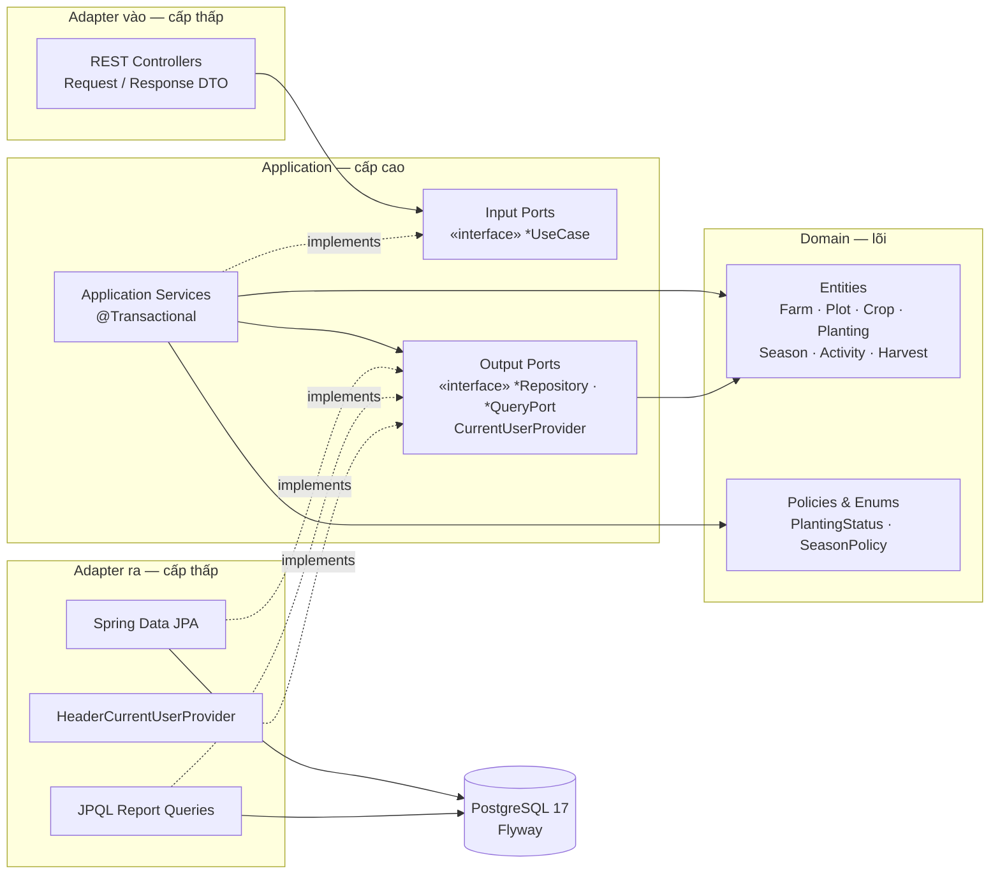
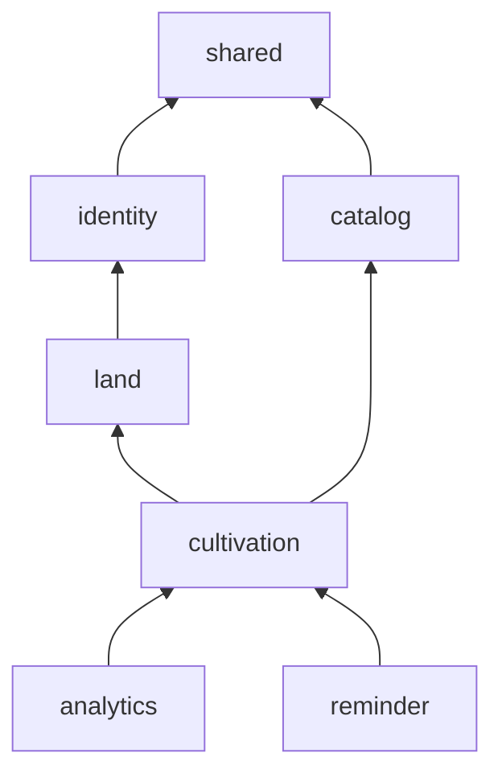
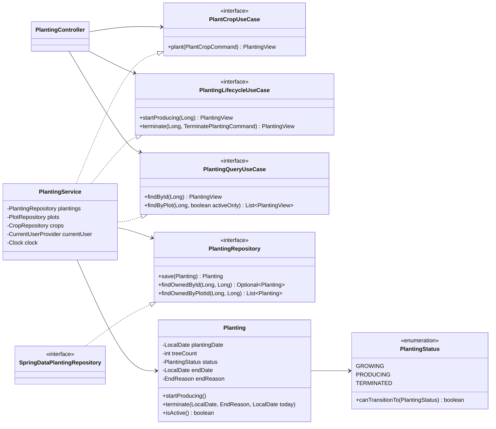
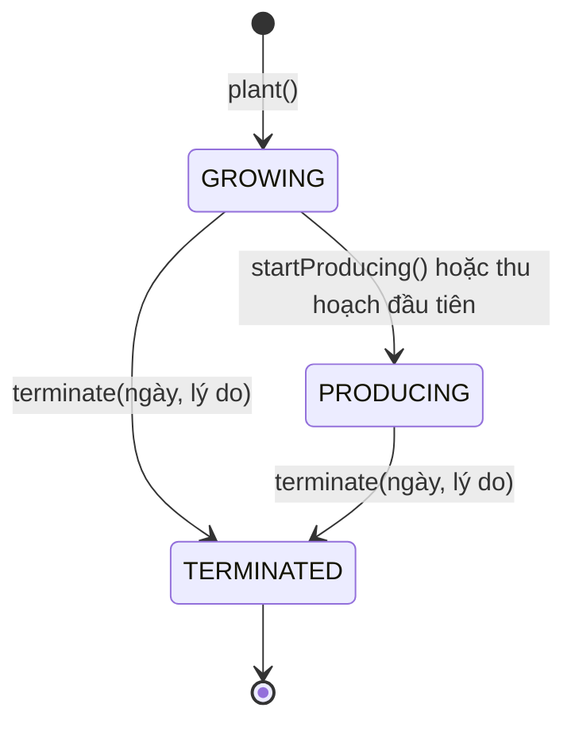
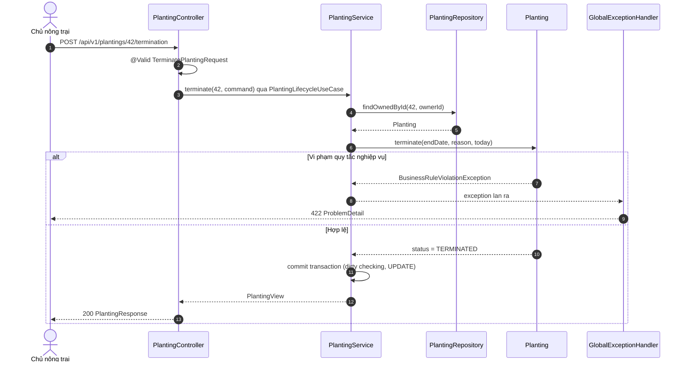

# Hệ thống Quản lý Canh tác Nông trại — Tài liệu Kiến trúc

> **Phiên bản:** 1.0 · **Ngày:** 17/09/2026 · **Dựa trên:** [`design.md`](design.md) (Phase 0)
>
> Tài liệu này mô tả **cách xây dựng** hệ thống: phong cách kiến trúc, quy tắc phụ
> thuộc giữa module cấp cao và cấp thấp, các interface làm rào cản trừu tượng, cách áp
> dụng SOLID, quy tắc nghiệp vụ, thiết kế API và lộ trình triển khai.

---

## 1. Tóm tắt quyết định

| Khía cạnh | Lựa chọn |
|---|---|
| Phong cách | **Modular monolith**, chia theo bounded context; bên trong mỗi module là **Hexagonal / Clean Architecture** (Ports & Adapters) |
| Quy tắc phụ thuộc | Mọi phụ thuộc mã nguồn **hướng vào trong**: `web`/`infrastructure` → `application` → `domain`. Domain không biết HTTP, SQL, Spring MVC |
| Rào cản trừu tượng | **Input port** (`*UseCase`) giữa Web và Application; **Output port** (`*Repository`, `*QueryPort`, `CurrentUserProvider`, `Clock`) giữa Application và hạ tầng |
| Mô hình domain | **Rich domain model** — bất biến nghiệp vụ nằm trong entity (`Planting.terminate()`), không nằm rải rác trong service |
| Persistence | Spring Data JPA + PostgreSQL 17, **Flyway** quản lý schema, `ddl-auto=validate` |
| Lỗi | Phân cấp exception domain → **RFC 9457 `ProblemDetail`** qua một `@RestControllerAdvice` duy nhất |
| Bảo vệ kiến trúc | **ArchUnit test** chặn vi phạm quy tắc phụ thuộc ngay khi build |

---

## 2. Cấp cao, cấp thấp và rào cản trừu tượng

**Module cấp cao** chứa *chính sách* — lý do hệ thống tồn tại: quy tắc vòng đời lứa
trồng, cách tính lãi/lỗ, luật nhắc việc. **Module cấp thấp** chứa *chi tiết* — cách thực
hiện: PostgreSQL, JPA, HTTP/JSON, JWT, đồng hồ hệ thống.

Theo **Dependency Inversion Principle**: *module cấp cao không phụ thuộc module cấp thấp;
cả hai phụ thuộc vào abstraction. Abstraction thuộc về phía cấp cao* — interface được
khai báo trong `application`, cấp thấp implement nó.

| Cấp cao (sử dụng) | Rào cản — interface | Cấp thấp (implement) |
|---|---|---|
| `PlantingService` | `PlantingRepository` | `SpringDataPlantingRepository` → PostgreSQL |
| `ProfitLossReportService` | `ProfitLossQueryPort` | `JpqlProfitLossQueryAdapter` (truy vấn tổng hợp) |
| Mọi application service | `CurrentUserProvider` | `HeaderCurrentUserProvider` (MVP) → `JwtCurrentUserProvider` (Phase 5) |
| `Planting`, `SeasonService` | `java.time.Clock` | `Clock.systemDefaultZone()` / `Clock.fixed()` trong test |
| `CareReminderService` | `CareRule` | `DrySeasonIrrigationRule`, `PostHarvestPruningRule`, … |
| `SeasonService` | `SeasonPolicy` | `PerennialSeasonPolicy`, `AnnualSeasonPolicy` |
| `PlantingController` | `PlantCropUseCase`, `PlantingLifecycleUseCase`, `PlantingQueryUseCase` | `PlantingService` |
| `PlotService`, `CropService` (kiểm tra trước khi xóa) | `PlotUsagePort`, `CropUsagePort` | Adapter trong module `cultivation` (M2) |

`PlotUsagePort`/`CropUsagePort` là DIP ở cấp **module**: `cultivation` phụ thuộc `land` và
`catalog`, nên `land` không được hỏi thẳng `cultivation` "lô này còn lứa trồng không".
`land` khai báo interface, `cultivation` implement — đồ thị module vẫn không có chu trình.
Service nhận `List<…UsagePort>` nên khi chưa có module nào implement, danh sách rỗng.

Hệ quả thực tế: đổi PostgreSQL sang DB khác, thêm xác thực JWT, hay thêm luật nhắc việc
mới **không cần sửa một dòng nào** trong domain và application service.

### 2.1 Sơ đồ kiến trúc tổng thể



Mũi tên liền = "phụ thuộc / gọi"; mũi tên đứt = "implement". Không có mũi tên nào đi
từ `APP` hay `DOM` ra các khối adapter.

---

## 3. Cấu trúc module

### 3.1 Bounded context

| Module | Trách nhiệm | Thực thể |
|---|---|---|
| `shared` | Hạ tầng dùng chung: base entity, exception, xử lý lỗi, cấu hình | — |
| `identity` | Người dùng và chủ sở hữu hiện tại | `User` |
| `land` | Nông trại và lô đất (Epic A) | `Farm`, `Plot` |
| `catalog` | Danh mục loại cây trồng | `Crop` |
| `cultivation` | Lứa trồng, vòng đời, niên vụ, nhật ký, thu hoạch (Epic B–E) | `Planting`, `Season`, `Activity`, `Harvest` |
| `analytics` | Báo cáo lãi/lỗ theo cây, lô, năm (Phase 2) | read model |
| `reminder` | Engine nhắc việc chăm sóc (Phase 2) | read model |

Phụ thuộc giữa module là **đồ thị có hướng không chu trình** (Acyclic Dependencies Principle):



### 3.2 Cây package

```
com.hmdao.farm
├── FarmManagementApplication.java
├── shared
│   ├── domain            BaseEntity, DomainException, ResourceNotFoundException,
│   │                     BusinessRuleViolationException, ResourceConflictException,
│   │                     UnauthenticatedException
│   ├── web               GlobalExceptionHandler
│   └── config            ClockConfig, OpenApiConfig
├── identity
│   ├── domain            User
│   ├── application/port  CurrentUserProvider, UserRepository
│   └── infrastructure    HeaderCurrentUserProvider, SpringDataUserRepository
├── land
│   ├── domain            Farm, Plot
│   ├── application
│   │   ├── port/in       ManageFarmUseCase, ManagePlotUseCase
│   │   ├── port/out      FarmRepository, PlotRepository, PlotUsagePort
│   │   ├── dto           FarmCommand, FarmView, FarmLandSummary, PlotCommand, PlotView
│   │   └── service       FarmService, PlotService
│   ├── infrastructure    SpringDataFarmRepository, SpringDataPlotRepository
│   └── web               FarmController, PlotController, dto/
├── catalog               (cùng cấu trúc — Crop)
├── cultivation           (cùng cấu trúc — Planting, Season, Activity, Harvest)
├── analytics             (Phase 2)
└── reminder              (Phase 2)
```

### 3.3 Chi tiết Ports & Adapters — module `cultivation` (lứa trồng)



---

## 4. Áp dụng SOLID

| Nguyên lý | Áp dụng cụ thể trong hệ thống |
|---|---|
| **S** — Single Responsibility | Controller chỉ dịch HTTP ↔ command/view. Service điều phối một nhóm use case trong một transaction. Entity giữ bất biến của chính nó. Mapper chỉ chuyển đổi. `GlobalExceptionHandler` là nơi duy nhất quyết định HTTP status của lỗi. |
| **O** — Open/Closed | Thêm luật nhắc việc = thêm một `@Component` implement `CareRule`; engine nhận `List<CareRule>` nên không phải sửa. Thêm loại cây có quy tắc niên vụ khác = thêm một `SeasonPolicy`. Bảng chuyển trạng thái nằm trong enum `PlantingStatus`. |
| **L** — Liskov Substitution | Mọi `SeasonPolicy` tuân cùng hợp đồng: không tăng điều kiện đầu vào, chỉ ném `BusinessRuleViolationException`. `HeaderCurrentUserProvider` và `JwtCurrentUserProvider` thay thế nhau mà service không đổi hành vi. `Clock.fixed()` thay `Clock.system…()` trong test. |
| **I** — Interface Segregation | Không có "fat service interface": `PlantCropUseCase`, `PlantingLifecycleUseCase`, `PlantingQueryUseCase` tách riêng. Output port chỉ khai báo đúng method cần — không lộ `deleteAllInBatch()` hay `flush()` của `JpaRepository` lên tầng application. |
| **D** — Dependency Inversion | Application khai báo port, infrastructure implement. Controller phụ thuộc interface use case. Thời gian lấy qua `Clock` bean, người dùng hiện tại qua `CurrentUserProvider` — không gọi `LocalDate.now()` hay đọc header trực tiếp trong nghiệp vụ. |

---

## 5. Vòng đời lứa trồng



Lý do kết thúc (`EndReason`): `MARKET` (giá thị trường), `PEST_DISEASE` (sâu bệnh),
`WEATHER` (thời tiết), `OLD_AGE` (già cỗi), `OTHER`.

### 5.1 Luồng xử lý một request — cưa bỏ lứa trồng



---

## 6. Quy tắc nghiệp vụ

Mỗi quy tắc có mã để truy vết tới test case.

| Mã | Quy tắc | Nơi kiểm tra | Lỗi |
|---|---|---|---|
| BR-01 | Tên nông trại/lô/cây trồng không trống; diện tích lô > 0 m²; tên lô duy nhất trong một nông trại; tên + giống cây duy nhất trong danh mục (không phân biệt hoa thường) | DTO + DB `CHECK`/`UNIQUE` | 400 / 409 |
| BR-02 | Ngày trồng không ở tương lai; số cây > 0 | `Planting` | 422 |
| BR-03 | Chỉ chuyển GROWING→PRODUCING, GROWING/PRODUCING→TERMINATED; TERMINATED là trạng thái cuối | `PlantingStatus` | 422 |
| BR-04 | Kết thúc lứa trồng bắt buộc có lý do; ngày kết thúc ≥ ngày trồng và ≤ hôm nay | `Planting.terminate()` | 422 |
| BR-05 | Mỗi lứa trồng có tối đa một niên vụ cho mỗi năm; cây ngắn ngày tối đa một niên vụ | `SeasonPolicy` + DB `UNIQUE` | 409 / 422 |
| BR-05a | Niên vụ bắt đầu theo `CROP.season_start_month` (1–12). Khi ghi hoạt động/thu hoạch, hệ thống tự gán vào niên vụ chứa ngày đó; chưa có thì tự tạo | `SeasonAssigner` | — |
| BR-06 | Niên vụ: ngày bắt đầu ≤ ngày kết thúc, không trước ngày trồng, không sau ngày cưa bỏ | `Season` | 422 |
| BR-07 | Hoạt động/thu hoạch phải có ngày nằm trong niên vụ và không sau ngày kết thúc lứa trồng | `Season` | 422 |
| BR-08 | Chi phí ≥ 0; sản lượng > 0 kg; doanh thu ≥ 0; tiền là `BigDecimal` `NUMERIC(15,2)` | DTO + DB `CHECK` | 400 |
| BR-09 | Lần thu hoạch đầu tiên của lứa đang GROWING tự động chuyển sang PRODUCING | `HarvestService` | — |
| BR-10 | Không xóa nông trại/lô/cây trồng/lứa trồng/niên vụ còn dữ liệu con (409); bản ghi rỗng tạo nhầm được xóa. Lứa trồng muốn "bỏ" thì dùng `terminate()`. Hoạt động và thu hoạch được xóa thật để sửa nhập sai | Service + DB `FK RESTRICT` | 409 |
| BR-11 | Dữ liệu giới hạn theo chủ sở hữu; tài nguyên của người khác trả 404 để không lộ sự tồn tại | Truy vấn `findOwned…` | 404 |

Validation hai lớp: **cú pháp** (Bean Validation trên request DTO → 400) và **ngữ nghĩa**
(bất biến domain → 422). Ràng buộc DB (`CHECK`, `UNIQUE`, `FK`) là lớp phòng thủ cuối.

---

## 7. Thiết kế REST API

Tiền tố `/api/v1`. Tài liệu tương tác tại `/swagger-ui.html`.

| Tài nguyên | Endpoint |
|---|---|
| Nông trại | `GET POST /farms` · `GET PUT DELETE /farms/{id}` |
| Lô đất | `GET POST /farms/{farmId}/plots` · `GET PUT DELETE /plots/{id}` |
| Cây trồng | `GET POST /crops` · `GET PUT DELETE /crops/{id}` |
| Lứa trồng | `GET POST /plots/{plotId}/plantings?activeOnly=true` · `GET PUT /plantings/{id}` |
| Vòng đời | `POST /plantings/{id}/production-start` · `POST /plantings/{id}/termination` |
| Niên vụ | `GET POST /plantings/{id}/seasons` · `GET PUT DELETE /seasons/{id}` |
| Hoạt động | `GET POST /seasons/{id}/activities` (phân trang) · `PUT DELETE /activities/{id}` |
| Thu hoạch | `GET POST /seasons/{id}/harvests` · `PUT DELETE /harvests/{id}` |
| Báo cáo (P2) | `GET /reports/profit-loss?groupBy=CROP\|PLOT\|PLANTING&year=&farmId=` |
| Nhắc việc (P2) | `GET /reminders?farmId=` |

Hành động vòng đời được mô hình hóa thành **tài nguyên con** (`/termination`) thay vì
`PATCH status`, vì chúng có dữ liệu riêng (ngày, lý do) và quy tắc riêng.

---

## 8. Giải pháp tối ưu

| Vấn đề | Giải pháp |
|---|---|
| N+1 trên `Plot → Planting → Season → Harvest` | `@EntityGraph` trên truy vấn danh sách; báo cáo dùng **JPQL aggregate + DTO projection** (một câu SQL `GROUP BY`, không load entity); `hibernate.default_batch_fetch_size=50` |
| Lazy loading rò rỉ ra tầng web | `spring.jpa.open-in-view=false`; controller chỉ nhận `View` record đã map xong trong transaction |
| Hiệu năng truy vấn | PostgreSQL **không tự tạo index cho FK** → tạo index cho mọi FK; `UNIQUE (planting_id, year)`; partial index `WHERE status <> 'TERMINATED'` cho lứa đang sống |
| Cập nhật đồng thời | `@Version` (optimistic locking) trên `Planting`, `Season` → 409 khi xung đột |
| Toàn vẹn dữ liệu | Enum lưu `STRING`; `CHECK` constraint phản chiếu bất biến domain; FK `ON DELETE RESTRICT` |
| Tiền tệ | `BigDecimal` + `NUMERIC(15,2)`, không dùng `double` |
| Schema | Flyway migration có version + `ddl-auto=validate` |
| Transaction | `@Transactional` ở application service; `readOnly = true` cho truy vấn |
| Danh sách dài | Phân trang `Pageable` cho nhật ký hoạt động và thu hoạch |
| Kiểm thử ngày tháng | Inject `Clock` → test tái lập được |
| Giữ kiến trúc sạch theo thời gian | ArchUnit: `domain` không import `web`/`infrastructure`/Spring MVC; không có chu trình giữa module |

### Chiến lược kiểm thử

| Tầng | Công cụ | Mục tiêu |
|---|---|---|
| Domain | JUnit 5 thuần, không Spring | Bất biến BR-02 → BR-09 |
| Application | JUnit 5 + Mockito mock **output port** | Điều phối use case — lợi ích trực tiếp của DIP |
| Web | `@WebMvcTest` + mock **input port** | Validation, mã HTTP, định dạng `ProblemDetail` |
| Persistence | `@DataJpaTest` + Testcontainers PostgreSQL | Truy vấn, `@EntityGraph`, migration |
| Kiến trúc | ArchUnit | Quy tắc phụ thuộc |

---

## 9. Ghi nhận quyết định kiến trúc (ADR)

1. **Modular monolith thay vì microservices.** Một chủ nông trại, một DB, tải thấp —
   microservices chỉ thêm độ trễ mạng và vận hành. Ranh giới module rõ ràng giữ khả năng
   tách service sau này.
2. **Entity domain mang annotation JPA.** `jakarta.persistence` là đặc tả, không phải
   implementation. Tách domain model và JPA entity sẽ biến 8 class thành 24 (thêm JPA
   entity + mapper), mất dirty checking/`@Version` tự động, trong khi khả năng thay ORM
   gần như bằng không. *Đánh đổi chấp nhận:* domain biết annotation ORM.
   *Rào chắn (ArchUnit):* domain chỉ được import `jakarta.persistence`, không
   `org.springframework`/`org.hibernate`; entity không có setter public, trạng thái đổi
   qua method nghiệp vụ. *Xem lại khi:* cấu trúc lưu trữ bắt đầu khác cấu trúc nghiệp vụ.
3. **Spring Data interface implement trực tiếp output port.**
   `interface SpringDataPlantingRepository extends Repository<Planting, Long>, PlantingRepository`
   — Spring sinh implementation, không cần lớp adapter thủ công, chiều phụ thuộc vẫn đúng
   (infrastructure → application). Khi cần ánh xạ phức tạp, dùng adapter class riêng.
4. **Giữ tầng `SEASON` + thêm `CROP.season_start_month`.** Niên vụ không trùng năm
   dương lịch. Chu kỳ sản xuất cà phê Robusta Tây Nguyên: tưới ra hoa tháng 2–3, bón phân
   mùa mưa tháng 5–9, thu hoạch tháng 11 đến tháng 1 năm sau — tức niên vụ 2025/2026 chạy
   từ 1/2/2025 đến 31/1/2026. Gom theo `YEAR(ngày)` sẽ cắt đôi vụ thu hoạch (tháng 11/2025
   và tháng 1/2026) và ghép sai chi phí với doanh thu. Để người dùng không phải thao tác
   thêm, niên vụ được **tự gán** theo ngày ghi nhật ký và tháng bắt đầu niên vụ của loại
   cây (BR-05a). `SEASON.year` là năm bắt đầu niên vụ, hiển thị dạng `2025/2026`.
   *Lưu ý:* đây là niên vụ theo chu kỳ sản xuất (để tính lãi/lỗ), khác niên vụ thương mại
   tính từ 1/10. Tháng bắt đầu mặc định của từng loại cây chỉnh được trong danh mục.
5. **Input port chia theo nhóm use case (ISP)** thay vì một interface lớn cho mỗi service.
6. **Chặn xóa (409) thay vì cascade, chưa dùng xóa mềm.** Cascade: một lần bấm nhầm xóa
   vĩnh viễn nhiều năm chi phí/doanh thu, báo cáo cũ thay đổi. Xóa mềm (`deleted_at`):
   mọi truy vấn phải nhớ lọc, dễ lọt dữ liệu vào báo cáo, vướng `UNIQUE` tên lô — trong khi
   trạng thái `TERMINATED` đã giữ được lịch sử cho lứa trồng. Chi tiết theo loại dữ liệu ở
   BR-10.
7. **Giới hạn phạm vi đã biết:** chi phí dùng chung cho cả lô xen canh (vd. tưới cả lô)
   hiện ghi vào từng lứa trồng; phân bổ theo tỷ lệ diện tích/số cây để ở giai đoạn sau.

---

## 10. Lộ trình triển khai và điểm dừng kiểm tra

Sau mỗi mốc, dừng lại để chủ dự án chụp màn hình và đối chiếu với `design.md`.

| Mốc | Nội dung | Bằng chứng kiểm tra |
|---|---|---|
| M0 | Tài liệu kiến trúc (tài liệu này) | Sơ đồ và bảng thiết kế |
| M1 | Nền tảng: dọn skeleton, Flyway, OpenAPI, xử lý lỗi, identity; Epic A (Farm, Plot) + danh mục Crop | Swagger UI, test pass |
| M2 | Epic B–C: lứa trồng, xen canh, vòng đời | Swagger: trồng xen, cưa bỏ, lỗi 422 |
| M3 | Epic D–E: niên vụ, nhật ký hoạt động, thu hoạch | Swagger + test |
| M4 | Phase 2: báo cáo lãi/lỗ, engine nhắc việc | Kết quả báo cáo |
| M5 | Phase 3: Testcontainers, ArchUnit, hoàn thiện tài liệu API | Báo cáo test |
| M6 | Phase 4: Frontend React + Tailwind | Giao diện |
| M7 | Docker Compose, cấu hình triển khai | Hệ thống chạy trong container |
