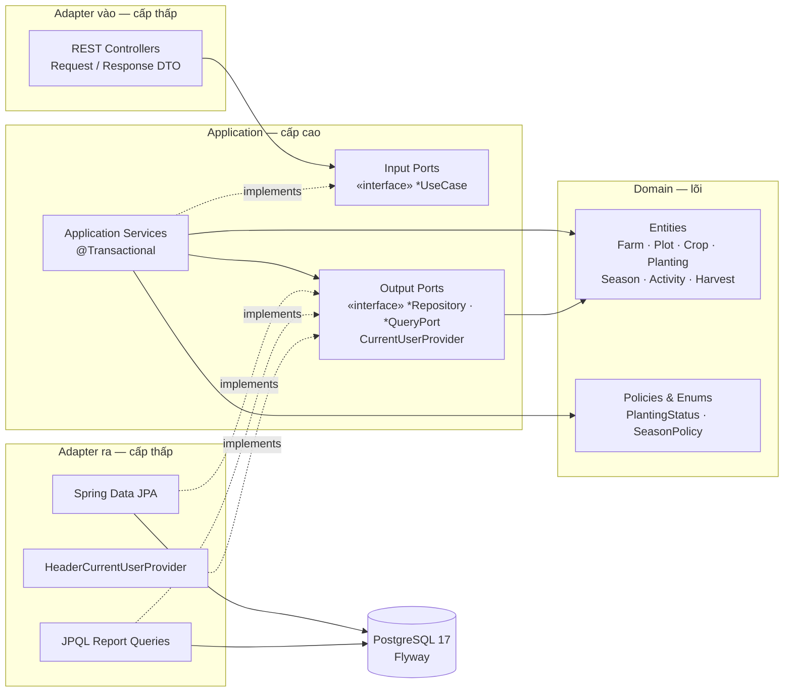
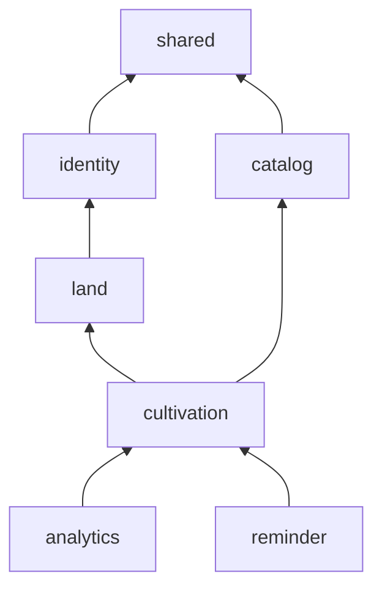
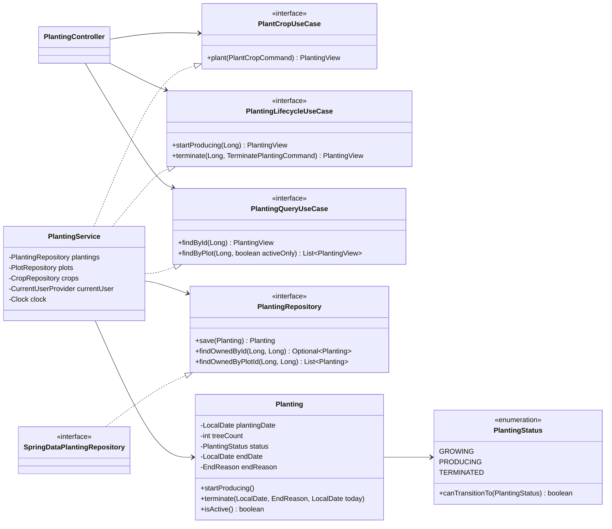
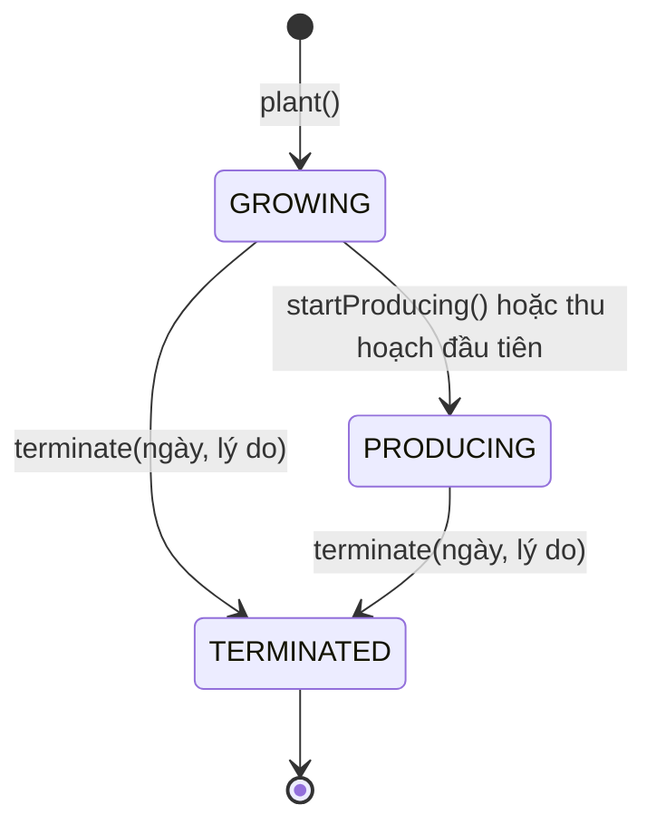
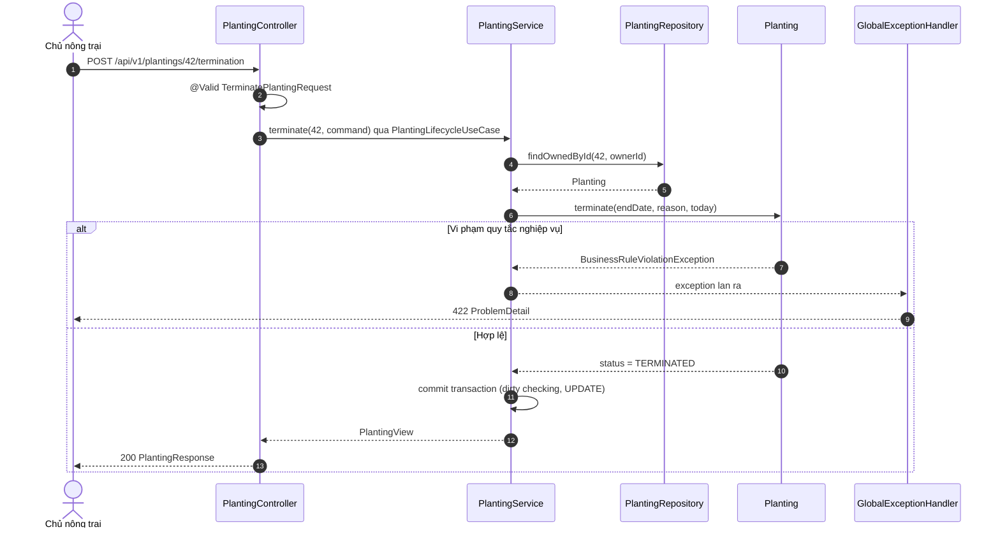

# Hệ thống Quản lý Canh tác Nông trại — Tài liệu Kiến trúc

> **Phiên bản:** 1.0 · **Ngày:** 17/09/2026 · **Dựa trên:** [`design.md`](design.md) (Phase 0)
>
> Tài liệu này mô tả **cách xây dựng** hệ thống: phong cách kiến trúc, quy tắc phụ
> thuộc giữa module cấp cao và cấp thấp, các interface làm rào cản trừu tượng, cách áp
> dụng SOLID, quy tắc nghiệp vụ, thiết kế API và lộ trình triển khai.

---

## 1. Tóm tắt quyết định

| Khía cạnh | Lựa chọn |
|---|---|
| Phong cách | **Modular monolith**, chia theo bounded context; bên trong mỗi module là **Hexagonal / Clean Architecture** (Ports & Adapters) |
| Quy tắc phụ thuộc | Mọi phụ thuộc mã nguồn **hướng vào trong**: `web`/`infrastructure` → `application` → `domain`. Domain không biết HTTP, SQL, Spring MVC |
| Rào cản trừu tượng | **Input port** (`*UseCase`) giữa Web và Application; **Output port** (`*Repository`, `*QueryPort`, `CurrentUserProvider`, `Clock`) giữa Application và hạ tầng |
| Mô hình domain | **Rich domain model** — bất biến nghiệp vụ nằm trong entity (`Planting.terminate()`), không nằm rải rác trong service |
| Persistence | Spring Data JPA + PostgreSQL 17, **Flyway** quản lý schema, `ddl-auto=validate` |
| Lỗi | Phân cấp exception domain → **RFC 9457 `ProblemDetail`** qua một `@RestControllerAdvice` duy nhất |
| Bảo vệ kiến trúc | **ArchUnit test** chặn vi phạm quy tắc phụ thuộc ngay khi build |

---

## 2. Cấp cao, cấp thấp và rào cản trừu tượng

**Module cấp cao** chứa *chính sách* — lý do hệ thống tồn tại: quy tắc vòng đời lứa
trồng, cách tính lãi/lỗ, luật nhắc việc. **Module cấp thấp** chứa *chi tiết* — cách thực
hiện: PostgreSQL, JPA, HTTP/JSON, JWT, đồng hồ hệ thống.

Theo **Dependency Inversion Principle**: *module cấp cao không phụ thuộc module cấp thấp;
cả hai phụ thuộc vào abstraction. Abstraction thuộc về phía cấp cao* — interface được
khai báo trong `application`, cấp thấp implement nó.

| Cấp cao (sử dụng) | Rào cản — interface | Cấp thấp (implement) |
|---|---|---|
| `PlantingService` | `PlantingRepository` | `SpringDataPlantingRepository` → PostgreSQL |
| `ProfitLossReportService` | `ProfitLossQueryPort` | `JpqlProfitLossQueryAdapter` (truy vấn tổng hợp) |
| Mọi application service | `CurrentUserProvider` | `HeaderCurrentUserProvider` (MVP) → `JwtCurrentUserProvider` (Phase 5) |
| `Planting`, `SeasonService` | `java.time.Clock` | `Clock.systemDefaultZone()` / `Clock.fixed()` trong test |
| `CareReminderService` | `CareRule` | `DrySeasonIrrigationRule`, `PostHarvestPruningRule`, … |
| `SeasonAssigner` | `SeasonPolicy` | `PerennialSeasonPolicy`, `AnnualSeasonPolicy` |
| `PlantingController` | `PlantCropUseCase`, `PlantingLifecycleUseCase`, `PlantingQueryUseCase` | `PlantingService` |
| `PlotService`, `CropService` (kiểm tra trước khi xóa) | `PlotUsagePort`, `CropUsagePort` | `PlotUsageAdapter`, `CropUsageAdapter` trong module `cultivation` |

`PlotUsagePort`/`CropUsagePort` là DIP ở cấp **module**: `cultivation` phụ thuộc `land` và
`catalog`, nên `land` không được hỏi thẳng `cultivation` "lô này còn lứa trồng không".
`land` khai báo interface, `cultivation` implement — đồ thị module vẫn không có chu trình.
Service nhận `List<…UsagePort>` nên khi chưa có module nào implement, danh sách rỗng.

Hệ quả thực tế: đổi PostgreSQL sang DB khác, thêm xác thực JWT, hay thêm luật nhắc việc
mới **không cần sửa một dòng nào** trong domain và application service.

### 2.1 Sơ đồ kiến trúc tổng thể



Mũi tên liền = "phụ thuộc / gọi"; mũi tên đứt = "implement". Không có mũi tên nào đi
từ `APP` hay `DOM` ra các khối adapter.

---

## 3. Cấu trúc module

### 3.1 Bounded context

| Module | Trách nhiệm | Thực thể |
|---|---|---|
| `shared` | Hạ tầng dùng chung: base entity, exception, xử lý lỗi, cấu hình | — |
| `identity` | Người dùng và chủ sở hữu hiện tại | `User` |
| `land` | Nông trại và lô đất (Epic A) | `Farm`, `Plot` |
| `catalog` | Danh mục loại cây trồng | `Crop` |
| `cultivation` | Lứa trồng, vòng đời, niên vụ, nhật ký, thu hoạch (Epic B–E) | `Planting`, `Season`, `Activity`, `Harvest` |
| `analytics` | Báo cáo lãi/lỗ theo cây, lô, năm (Phase 2) | read model |
| `reminder` | Engine nhắc việc chăm sóc (Phase 2) | read model |

Phụ thuộc giữa module là **đồ thị có hướng không chu trình** (Acyclic Dependencies Principle):



### 3.2 Cây package

```
com.hmdao.farm
├── FarmManagementApplication.java
├── shared
│   ├── domain            BaseEntity, DomainException, ResourceNotFoundException,
│   │                     BusinessRuleViolationException, ResourceConflictException,
│   │                     UnauthenticatedException
│   ├── web               GlobalExceptionHandler
│   └── config            ClockConfig, OpenApiConfig
├── identity
│   ├── domain            User
│   ├── application/port  CurrentUserProvider, UserRepository
│   └── infrastructure    HeaderCurrentUserProvider, SpringDataUserRepository
├── land
│   ├── domain            Farm, Plot
│   ├── application
│   │   ├── port/in       ManageFarmUseCase, ManagePlotUseCase
│   │   ├── port/out      FarmRepository, PlotRepository, PlotUsagePort
│   │   ├── dto           FarmCommand, FarmView, FarmLandSummary, PlotCommand, PlotView
│   │   └── service       FarmService, PlotService
│   ├── infrastructure    SpringDataFarmRepository, SpringDataPlotRepository
│   └── web               FarmController, PlotController, dto/
├── catalog               (cùng cấu trúc — Crop)
├── cultivation           (cùng cấu trúc — Planting, Season, Activity, Harvest)
│   └── config            CultivationConfig — khai báo bean cho các SeasonPolicy
├── analytics
│   ├── domain            ProfitLossGrouping
│   ├── application       port/in ProfitLossReportUseCase · port/out ProfitLossQueryPort
│   │                     dto ProfitLossReport, ProfitLossRow, … · service ProfitLossReportService
│   ├── infrastructure    JpqlProfitLossQueryAdapter
│   └── web               ReportController, dto/
└── reminder
    ├── domain            CareRule + các luật, CareContext, Reminder, ReminderSeverity
    ├── application       port/in CareReminderUseCase · port/out CareContextQueryPort
    │                     service CareReminderService
    ├── config            ReminderConfig — khai báo bean cho các CareRule
    ├── infrastructure    JpqlCareContextQueryAdapter
    └── web               ReminderController, dto/

Chính sách nghiệp vụ (`SeasonPolicy`, `CareRule`) nằm ở `domain` nên không mang annotation
Spring — ArchUnit chặn. Mỗi module có một lớp `config` khai báo chúng thành bean, service
nhận `List<…>` và không phải sửa khi có luật mới.
```

### 3.3 Chi tiết Ports & Adapters — module `cultivation` (lứa trồng)



---

## 4. Áp dụng SOLID

| Nguyên lý | Áp dụng cụ thể trong hệ thống |
|---|---|
| **S** — Single Responsibility | Controller chỉ dịch HTTP ↔ command/view. Service điều phối một nhóm use case trong một transaction. Entity giữ bất biến của chính nó. Mapper chỉ chuyển đổi. `GlobalExceptionHandler` là nơi duy nhất quyết định HTTP status của lỗi. |
| **O** — Open/Closed | Thêm luật nhắc việc = thêm một `@Component` implement `CareRule`; engine nhận `List<CareRule>` nên không phải sửa. Thêm loại cây có quy tắc niên vụ khác = thêm một `SeasonPolicy`. Bảng chuyển trạng thái nằm trong enum `PlantingStatus`. |
| **L** — Liskov Substitution | Mọi `SeasonPolicy` tuân cùng hợp đồng: không tăng điều kiện đầu vào, chỉ ném `BusinessRuleViolationException`. `HeaderCurrentUserProvider` và `JwtCurrentUserProvider` thay thế nhau mà service không đổi hành vi. `Clock.fixed()` thay `Clock.system…()` trong test. |
| **I** — Interface Segregation | Không có "fat service interface": `PlantCropUseCase`, `PlantingLifecycleUseCase`, `PlantingQueryUseCase` tách riêng. Output port chỉ khai báo đúng method cần — không lộ `deleteAllInBatch()` hay `flush()` của `JpaRepository` lên tầng application. |
| **D** — Dependency Inversion | Application khai báo port, infrastructure implement. Controller phụ thuộc interface use case. Thời gian lấy qua `Clock` bean, người dùng hiện tại qua `CurrentUserProvider` — không gọi `LocalDate.now()` hay đọc header trực tiếp trong nghiệp vụ. |

---

## 5. Vòng đời lứa trồng



Lý do kết thúc (`EndReason`): `MARKET` (giá thị trường), `PEST_DISEASE` (sâu bệnh),
`WEATHER` (thời tiết), `OLD_AGE` (già cỗi), `OTHER`.

### 5.1 Luồng xử lý một request — cưa bỏ lứa trồng



---

## 6. Quy tắc nghiệp vụ

Mỗi quy tắc có mã để truy vết tới test case.

| Mã | Quy tắc | Nơi kiểm tra | Lỗi |
|---|---|---|---|
| BR-01 | Tên nông trại/lô/cây trồng không trống; diện tích lô > 0 m²; tên lô duy nhất trong một nông trại; tên + giống cây duy nhất trong danh mục (không phân biệt hoa thường) | DTO + DB `CHECK`/`UNIQUE` | 400 / 409 |
| BR-02 | Ngày trồng không ở tương lai (theo giờ Việt Nam); số cây > 0. Lứa trồng mới là GROWING, hoặc PRODUCING khi số hóa vườn đã cho thu hoạch (`alreadyProducing`) | `Planting` | 422 |
| BR-03 | Chỉ chuyển GROWING→PRODUCING, GROWING/PRODUCING→TERMINATED; TERMINATED là trạng thái cuối | `PlantingStatus` | 422 |
| BR-04 | Kết thúc lứa trồng bắt buộc có lý do; ngày kết thúc ≥ ngày trồng và ≤ hôm nay; ghi chú tùy chọn. Sửa ngày trồng không được vượt ngày kết thúc | `Planting.terminate()` / `correct()` | 422 |
| BR-05 | Mỗi lứa trồng có tối đa một niên vụ cho mỗi năm; cây ngắn ngày chỉ có đúng một niên vụ | `SeasonPolicy` + DB `UNIQUE (planting_id, year)` | 409 |
| BR-05a | Niên vụ **do hệ thống sinh ra, không nhập tay**. Khi ghi hoạt động/thu hoạch, `SeasonPolicy` tính cửa sổ niên vụ chứa ngày đó rồi `SeasonAssigner` lấy niên vụ tương ứng, chưa có thì tạo. Cây lâu năm: cửa sổ `[ngày 1 của season_start_month, +1 năm − 1 ngày]`, cận dưới cắt theo ngày trồng. Cây ngắn ngày (`season_start_month` NULL): đúng một niên vụ, bắt đầu từ ngày trồng, `end_date` NULL nghĩa là đang diễn ra. Sửa ngày một hoạt động/thu hoạch sang cửa sổ khác thì bản ghi tự chuyển niên vụ | `SeasonPolicy` / `SeasonAssigner` | — |
| BR-06 | Niên vụ: ngày bắt đầu ≥ ngày trồng; ngày kết thúc để trống (đang diễn ra) hoặc ≥ ngày bắt đầu. Cận trên so với ngày cưa bỏ do BR-07 canh ở tầng bản ghi, vì `CHECK` không nhìn được sang bảng khác | `Season` + DB `CHECK` | 422 |
| BR-07 | Ngày ghi hoạt động/thu hoạch: ≥ ngày trồng, ≤ hôm nay (giờ Việt Nam), và ≤ ngày cưa bỏ nếu lứa đã kết thúc. Nằm trong niên vụ là hệ quả — niên vụ được suy ra từ chính ngày đó (BR-05a) | `Planting.requireRecordable()` | 422 |
| BR-08 | Chi phí ≥ 0, bỏ trống nghĩa là 0 (tự làm, không tốn chi phí); sản lượng > 0 kg; doanh thu ≥ 0; tiền là `BigDecimal` `NUMERIC(15,2)` | DTO + `Activity`/`Harvest` + DB `CHECK` | 400 / 422 |
| BR-09 | Lần thu hoạch đầu tiên của lứa đang GROWING tự động chuyển sang PRODUCING. Xóa hoặc sửa lại lần thu hoạch đó **không** đưa trạng thái về GROWING (xem ADR-9) | `HarvestService` | — |
| BR-10 | Không xóa nông trại/lô/cây trồng/lứa trồng/niên vụ còn dữ liệu con (409); bản ghi rỗng tạo nhầm được xóa. Lứa trồng muốn "bỏ" thì dùng `terminate()`. Hoạt động và thu hoạch được xóa thật để sửa nhập sai; niên vụ rỗng còn lại sau đó cũng xóa được | Service + DB `FK RESTRICT` | 409 |
| BR-11 | Dữ liệu giới hạn theo chủ sở hữu; tài nguyên của người khác trả 404 để không lộ sự tồn tại | Truy vấn `findOwned…` | 404 |
| BR-12 | Hoạt động loại `OTHER` bắt buộc có ghi chú — nếu không, nhật ký mất luôn ý nghĩa của dòng đó | `Activity` | 422 |
| BR-13 | Báo cáo gom theo `SEASON.year`, **không** theo năm dương lịch của ngày ghi nhận — nếu không, doanh thu cà phê tháng 1 sẽ tách khỏi chi phí tháng 3 vụ trước (BR-05a). `year` bỏ trống = mọi niên vụ; `farmId` bỏ trống = mọi nông trại của chủ sở hữu | `ProfitLossReportService` | — |
| BR-14 | Lứa trồng chưa có nhật ký/thu hoạch vẫn xuất hiện trong báo cáo với số 0. Vắng mặt sẽ bị hiểu là mất dữ liệu, trong khi `GROUP BY` thuần thì luôn bỏ qua nhóm rỗng | `ProfitLossQueryPort` | — |
| BR-15 | Lãi/lỗ luôn kèm chỉ số chuẩn hoá: trên 1.000 m², trên cây, kg trên cây. Số tuyệt đối không trả lời được "nơi nào canh tác hiệu quả" vì lô lớn luôn thắng lô nhỏ. Thiếu diện tích hoặc số cây thì để trống thay vì chia bừa | `ProfitLossRow` | — |
| BR-16 | Lô trồng xen được đánh cờ `sharedPlot`: chi phí dùng chung (vd. tưới cả lô) hiện ghi vào từng lứa, nên số liệu theo đơn vị diện tích của nhóm đó chỉ là ước lượng (ADR-10) | `ProfitLossReportService` | — |
| BR-17 | `groupBy=PLANTING` kèm luỹ kế và niên vụ hoàn vốn, tính trên **toàn bộ** niên vụ của lứa dù báo cáo đang lọc `year` — cây lâu năm lỗ vài năm kiến thiết cơ bản là bình thường, báo cáo theo năm mà thiếu luỹ kế sẽ kết luận sai | `ProfitLossReportService` | — |
| BR-18 | Nhắc việc chỉ tính cho lứa đang canh tác và **không lưu trạng thái**: lời nhắc biến mất khi nhật ký tương ứng được ghi. Không có nút "đã làm" vì nhà nông vẫn phải ghi nhật ký (ADR-12) | `CareReminderService` | — |

### 6.1. Luật nhắc việc (engine Epic F)

BR-18 nói engine hoạt động thế nào; bảng này liệt kê các luật cụ thể đang chạy. Mỗi luật là một
lớp riêng thực thi `CareRule`, được nạp qua `List<CareRule>` — thêm luật mới không sửa dòng nào
trong `CareReminderService` (OCP).

| Mã | Luật | Điều kiện áp dụng | Chu kỳ |
|---|---|---|---|
| CARE-01 | Tưới nước mùa khô | Cây lâu năm, tháng 12–4 (mùa khô Tây Nguyên) | 20 ngày |
| CARE-02 | Bón phân mùa mưa | Mọi loại cây, tháng 5–9 (đất đủ ẩm cây mới hấp thụ) | 45 ngày |
| CARE-03 | Tỉa cành sau thu hoạch | Sau lần thu hoạch gần nhất | 21 ngày |
| CARE-04 | Thăm vườn kiến thiết cơ bản | Vườn dưới 3 năm tuổi, chưa cho thu hoạch | 30 ngày |

Mùa suy ra từ tháng trong năm chứ không gọi dịch vụ thời tiết: thêm một phụ thuộc mạng vào
đường đọc chỉ để biết điều mà lịch canh tác đã nói sẵn là không đáng (ADR-12).

Validation hai lớp: **cú pháp** (Bean Validation trên request DTO → 400) và **ngữ nghĩa**
(bất biến domain → 422). Ràng buộc DB (`CHECK`, `UNIQUE`, `FK`) là lớp phòng thủ cuối.

---

## 7. Thiết kế REST API

Tiền tố `/api/v1`. Tài liệu tương tác tại `/swagger-ui.html`.

| Tài nguyên | Endpoint |
|---|---|
| Nông trại | `GET POST /farms` · `GET PUT DELETE /farms/{id}` |
| Lô đất | `GET POST /farms/{farmId}/plots` · `GET PUT DELETE /plots/{id}` |
| Cây trồng | `GET POST /crops` · `GET PUT DELETE /crops/{id}` |
| Lứa trồng | `GET POST /plots/{plotId}/plantings?activeOnly=true` · `GET /plantings?farmId=&activeOnly=true` (mọi lứa của chủ sở hữu, cho form ghi nhật ký — M6) · `GET PUT DELETE /plantings/{id}` (PUT/DELETE chỉ để sửa nhập sai) |
| Vòng đời | `POST /plantings/{id}/production-start` · `POST /plantings/{id}/termination` |
| Niên vụ | `GET /plantings/{id}/seasons` · `GET DELETE /seasons/{id}` — không có POST/PUT: niên vụ là dữ liệu dẫn xuất (ADR-7) |
| Hoạt động | `POST /plantings/{id}/activities` (tự gán niên vụ) · `GET /seasons/{id}/activities` (phân trang) · `GET PUT DELETE /activities/{id}` |
| Thu hoạch | `POST /plantings/{id}/harvests` (tự gán niên vụ) · `GET /seasons/{id}/harvests` (phân trang) · `GET PUT DELETE /harvests/{id}` |
| Báo cáo | `GET /reports/profit-loss?groupBy=CROP\|PLOT\|PLANTING&year=&farmId=` |
| Nhắc việc | `GET /reminders?farmId=` |

Hành động vòng đời được mô hình hóa thành **tài nguyên con** (`/termination`) thay vì
`PATCH status`, vì chúng có dữ liệu riêng (ngày, lý do) và quy tắc riêng.

Hoạt động và thu hoạch **ghi vào lứa trồng, đọc theo niên vụ**: người dùng chỉ biết "cây nào,
ngày nào", còn niên vụ là chuyện của hệ thống (BR-05a). Ghi vào `/seasons/{id}/…` sẽ buộc
client tự chọn niên vụ — đúng thứ mà BR-05a sinh ra để tránh.

Phân trang trả về `{ content, page, size, totalElements, totalPages }`; mặc định `size=20`,
tối đa 200.

---

## 8. Giải pháp tối ưu

| Vấn đề | Giải pháp |
|---|---|
| N+1 trên `Plot → Planting → Season → Harvest` | `@EntityGraph` trên truy vấn danh sách; báo cáo dùng **JPQL aggregate + DTO projection** (`GROUP BY`, không load entity); `hibernate.default_batch_fetch_size=50` |
| Lazy loading rò rỉ ra tầng web | `spring.jpa.open-in-view=false`; controller chỉ nhận `View` record đã map xong trong transaction |
| Hiệu năng truy vấn | PostgreSQL **không tự tạo index cho FK** → tạo index cho mọi FK; `UNIQUE (planting_id, year)`; partial index `WHERE status <> 'TERMINATED'` cho lứa đang sống |
| Cập nhật đồng thời | `@Version` (optimistic locking) trên `Planting`, `Season` → 409 khi xung đột |
| Toàn vẹn dữ liệu | Enum lưu `STRING`; `CHECK` constraint phản chiếu bất biến domain; FK `ON DELETE RESTRICT` |
| Tiền tệ | `BigDecimal` + `NUMERIC(15,2)`, không dùng `double` |
| Schema | Flyway migration có version + `ddl-auto=validate` |
| Transaction | `@Transactional` ở application service; `readOnly = true` cho truy vấn |
| Tổng hợp niên vụ (chi phí, sản lượng, doanh thu) | Hai truy vấn `GROUP BY` cho *cả danh sách* niên vụ (một cho `activity`, một cho `harvest`) rồi ghép trong service. Gộp hai bảng vào một câu sẽ nhân chéo dòng và cộng sai tổng |
| Báo cáo lãi/lỗ toàn nông trại | Đúng **3 truy vấn** bất kể số lô, lứa hay năm: 1 lấy hồ sơ lứa trồng (BR-14), 2 câu `GROUP BY (lứa, niên vụ)` cho chi phí và thu hoạch. Gom nhóm theo `CROP`/`PLOT`/`PLANTING` và tính luỹ kế làm trong service trên dữ liệu đã tổng hợp — không quay lại DB |
| Nhắc việc | Đúng **3 truy vấn**: 1 lấy lứa đang canh tác, 1 `MAX(ngày) GROUP BY (lứa, loại việc)`, 1 `MAX(ngày thu hoạch) GROUP BY lứa`. Luật chạy trên bộ nhớ, không luật nào tự truy vấn |
| Danh sách dài | Phân trang cho nhật ký hoạt động và thu hoạch, qua kiểu `Page`/`PageRequest` của ứng dụng (ADR-8) |
| Kiểm thử ngày tháng | Inject `Clock` → test tái lập được |
| Giữ kiến trúc sạch theo thời gian | ArchUnit: `domain` không import `web`/`infrastructure`/Spring MVC; không có chu trình giữa module |

### Chiến lược kiểm thử

| Tầng | Công cụ | Mục tiêu |
|---|---|---|
| Domain | JUnit thuần, không Spring | Bất biến BR-02 → BR-09, BR-12; chính sách niên vụ và luật nhắc việc (`CareRule` nhận `CareContext` dựng sẵn nên test không cần DB) |
| Application | JUnit + Mockito mock **output port** | Điều phối use case — lợi ích trực tiếp của DIP |
| Web | `@WebMvcTest` + mock **input port** | Validation, mã HTTP, định dạng `ProblemDetail` |
| Integration (`*IT`) | `@IntegrationTest` + Testcontainers PostgreSQL 17 | HTTP thật → DB thật: migration, ràng buộc, JPQL, và **số câu truy vấn** |
| Ràng buộc DB | `DatabaseConstraintsIT` — SQL thô, đi vòng qua domain | `CHECK`/`UNIQUE`/`FK RESTRICT` thật sự chặn, không chỉ domain chặn |
| Kiến trúc | ArchUnit, 13 luật | Quy tắc phụ thuộc, cạnh liên module, thời gian qua `Clock`, tiền là `BigDecimal` |
| Truy vết | `BusinessRuleCoverageTest` | Mọi mã BR/CARE trong tài liệu đều có test, và không test nào bịa ra mã mới |
| Hợp đồng API | `OpenApiContractIT` | `docs/openapi.json` khớp với đặc tả ứng dụng đang phục vụ (ADR-15) |

Bốn quyết định làm cho bộ test đứng vững theo thời gian:

- **Tách `mvn test` và `mvn verify`.** Test đơn vị (`*Test`) chạy trong surefire, không cần
  Docker, xong trong vài chục giây. Integration test (`*IT`) chạy trong failsafe. Thiếu Docker
  thì `*IT` được **bỏ qua kèm lý do** chứ không đổ ra một bức tường stack trace khiến người đọc
  không phân biệt được "máy thiếu Docker" với "code hỏng".
- **Một container cho cả bộ test.** Mọi lớp `*IT` khai báo qua đúng một annotation
  `@IntegrationTest`, nên Spring cache chung một application context — lệch một property là
  sinh thêm một context và thêm một container PostgreSQL. `DatabaseCleaner` `TRUNCATE ...
  RESTART IDENTITY` các bảng giao dịch trước mỗi test, giữ lại dữ liệu tham chiếu: không có
  test nào thừa hưởng dữ liệu của test chạy trước, và id sinh ra lặp lại được.
- **Đồng hồ do test cầm.** `MutableTestClock` thay `Clock.system()`, nên "đang là mùa khô" trở
  thành một dòng khai báo. Trước đó hai luật theo mùa (CARE-01, CARE-02) không thể kiểm ở mức
  API vì chỉ chạy đúng mùa — test sẽ xanh hay đỏ tùy tháng chạy.
- **Ngưỡng độ phủ trên lõi nghiệp vụ.** JaCoCo yêu cầu `domain` + `application.service` đạt
  ≥ 80% lệnh và ≥ 70% nhánh (hiện 91,6% / 84,0%). Cố ý không đặt 100%: con số đó chỉ khuyến
  khích viết test cho getter.

CI (`.github/workflows/build.yml`) chạy `mvnw verify` trên mọi nhánh và pull request. Runner của
GitHub luôn có Docker nên integration test luôn chạy ở đó — bằng chứng chất lượng không phụ
thuộc vào việc một máy cá nhân có bật Docker hay không. Bước cuối `git diff --exit-code
docs/openapi.json` bắt trường hợp hợp đồng API đổi mà chưa được commit.

---

## 9. Ghi nhận quyết định kiến trúc (ADR)

1. **Modular monolith thay vì microservices.** Một chủ nông trại, một DB, tải thấp —
   microservices chỉ thêm độ trễ mạng và vận hành. Ranh giới module rõ ràng giữ khả năng
   tách service sau này.
2. **Entity domain mang annotation JPA.** `jakarta.persistence` là đặc tả, không phải
   implementation. Tách domain model và JPA entity sẽ biến 8 class thành 24 (thêm JPA
   entity + mapper), mất dirty checking/`@Version` tự động, trong khi khả năng thay ORM
   gần như bằng không. *Đánh đổi chấp nhận:* domain biết annotation ORM.
   *Rào chắn (ArchUnit):* domain chỉ được import `jakarta.persistence`, không
   `org.springframework`/`org.hibernate`; entity không có setter public, trạng thái đổi
   qua method nghiệp vụ. *Xem lại khi:* cấu trúc lưu trữ bắt đầu khác cấu trúc nghiệp vụ.
3. **Spring Data interface implement trực tiếp output port.**
   `interface SpringDataPlantingRepository extends Repository<Planting, Long>, PlantingRepository`
   — Spring sinh implementation, không cần lớp adapter thủ công, chiều phụ thuộc vẫn đúng
   (infrastructure → application). Khi cần ánh xạ phức tạp, dùng adapter class riêng.
4. **Giữ tầng `SEASON` + thêm `CROP.season_start_month`.** Niên vụ không trùng năm
   dương lịch. Chu kỳ sản xuất cà phê Robusta Tây Nguyên: tưới ra hoa tháng 2–3, bón phân
   mùa mưa tháng 5–9, thu hoạch tháng 11 đến tháng 1 năm sau — tức niên vụ 2025/2026 chạy
   từ 1/2/2025 đến 31/1/2026. Gom theo `YEAR(ngày)` sẽ cắt đôi vụ thu hoạch (tháng 11/2025
   và tháng 1/2026) và ghép sai chi phí với doanh thu. Để người dùng không phải thao tác
   thêm, niên vụ được **tự gán** theo ngày ghi nhật ký và tháng bắt đầu niên vụ của loại
   cây (BR-05a). `SEASON.year` là năm bắt đầu niên vụ, hiển thị dạng `2025/2026`.
   *Lưu ý:* đây là niên vụ theo chu kỳ sản xuất (để tính lãi/lỗ), khác niên vụ thương mại
   tính từ 1/10. Tháng bắt đầu mặc định của từng loại cây chỉnh được trong danh mục.
5. **Input port chia theo nhóm use case (ISP)** thay vì một interface lớn cho mỗi service.
6. **Chặn xóa (409) thay vì cascade, chưa dùng xóa mềm.** Cascade: một lần bấm nhầm xóa
   vĩnh viễn nhiều năm chi phí/doanh thu, báo cáo cũ thay đổi. Xóa mềm (`deleted_at`):
   mọi truy vấn phải nhớ lọc, dễ lọt dữ liệu vào báo cáo, vướng `UNIQUE` tên lô — trong khi
   trạng thái `TERMINATED` đã giữ được lịch sử cho lứa trồng. Chi tiết theo loại dữ liệu ở
   BR-10.
7. **Niên vụ là dữ liệu dẫn xuất, không phải dữ liệu nhập.** API không có `POST`/`PUT`
   cho niên vụ: `SeasonPolicy` tính cửa sổ niên vụ từ ngày ghi nhận + `CROP.season_start_month`,
   `SeasonAssigner` tạo bản ghi khi cần (BR-05a). *Vì sao:* nếu người dùng tự nhập ngày bắt
   đầu/kết thúc thì các niên vụ có thể chồng lấn hoặc hở, và câu hỏi "hoạt động ngày 15/1/2026
   thuộc niên vụ nào" trở nên không có lời giải duy nhất — trong khi chính câu hỏi đó là thứ
   BR-05a phải trả lời tự động. Suy ra từ chính sách thì BR-06 đúng theo cấu trúc, không cần
   kiểm tra chồng lấn. *Đánh đổi:* nhà nông không tự nắn được ranh giới niên vụ; khi cần, chỉnh
   `season_start_month` trong danh mục cây trồng. *Xem lại khi:* xuất hiện nhu cầu niên vụ dài
   ngắn khác nhau trong cùng một loại cây.
8. **Kiểu phân trang riêng của ứng dụng** (`shared.application.Page`, `PageRequest`) thay vì
   `Pageable`/`Page` của Spring Data. ArchUnit cấm tầng `application` biết `org.springframework.data`;
   nếu để lọt, input port và use case sẽ dính chặt vào Spring Data và mất ý nghĩa của DIP. Adapter
   persistence chuyển đổi hai chiều ngay tại biên.
9. **Thu hoạch đầu tiên đẩy trạng thái sang PRODUCING, nhưng xóa đi thì không lùi lại.**
   Lùi trạng thái tự động là hiệu ứng phụ ngầm: xóa một dòng nhập nhầm có thể âm thầm đổi
   trạng thái lứa trồng, và nếu lứa đã được cưa bỏ thì việc lùi còn vi phạm BR-03 (TERMINATED là
   trạng thái cuối). Muốn sửa trạng thái thì sửa tường minh qua lứa trồng.
10. **Giới hạn phạm vi đã biết:** chi phí dùng chung cho cả lô xen canh (vd. tưới cả lô)
    hiện ghi vào từng lứa trồng; phân bổ theo tỷ lệ diện tích/số cây để ở giai đoạn sau.
    Báo cáo đánh cờ `sharedPlot` cho nhóm có lô trồng xen để người đọc biết số theo diện
    tích chỉ là ước lượng (BR-16).
11. **Báo cáo là read model riêng, không tái dùng `SeasonService`.** `SeasonService` trả
    view của *một* lứa trồng và đã đủ cho màn hình niên vụ; báo cáo cần cắt theo cây, lô,
    năm trên *toàn* nông trại. Dùng lại sẽ kéo theo N+1 (mỗi lứa một lần gọi) và ép
    `SeasonView` gánh thêm trường chỉ báo cáo mới cần. `analytics` khai báo
    `ProfitLossQueryPort` riêng, adapter trả thẳng DTO tổng hợp — *đọc* và *ghi* có hình
    dạng dữ liệu khác nhau thì tách mô hình (CQRS nhẹ, không event sourcing).
    *Đánh đổi:* hai chỗ cùng biết cách cộng tiền. Giữ đúng bằng test đối chiếu tổng của
    báo cáo với tổng của `SeasonView`.
12. **Nhắc việc không có trạng thái.** Không có bảng, không có nút "đã làm" / "bỏ qua":
    mỗi lần gọi, `CareReminderService` tính lại từ nhật ký. Lời nhắc tưới biến mất khi có
    bản ghi tưới — mà nhà nông vẫn phải ghi nhật ký, nên thêm nút "đã làm" chỉ tạo ra hai
    nguồn sự thật và một bảng phải dọn rác. *Đánh đổi:* chưa hoãn hay tắt được một lời
    nhắc cụ thể. *Xem lại khi:* người dùng phàn nàn về lời nhắc không liên quan lặp lại.
13. **Dữ liệu demo tách khỏi migration production.** `db/migration` chỉ chứa cấu trúc và dữ
    liệu *tham chiếu* (danh mục cây trồng — thứ mọi môi trường đều cần). Hai tài khoản chủ
    nông trại mẫu nằm ở `db/demo`, chỉ được nạp khi cấu hình khai thêm location đó: profile
    `dev` và integration test. Trộn chung sẽ đẩy tài khoản giả vào cơ sở dữ liệu thật ngay
    lần triển khai đầu tiên, và xóa sau thì luôn muộn hơn một bước.
14. **Lọc theo nông trại không phải của mình trả 404, không trả danh sách rỗng.** Trước M5,
    `/reports` và `/reminders` im lặng trả rỗng trong khi `/plots` trả 404 cho cùng một tình
    huống — cùng một quy tắc BR-11, hai cách đối xử. "Chưa ghi gì" và "không phải của bạn"
    là hai câu trả lời khác hẳn nhau; một màn hình trống không nói được điều gì cho người
    dùng. *Đánh đổi:* thêm đúng một truy vấn khóa chính khi request có `farmId` — trả giá
    ấy để lấy một hợp đồng API nhất quán là xứng đáng.
15. **Hợp đồng OpenAPI được version hoá trong repo.** `OpenApiContractIT` sinh
    `docs/openapi.json` từ ứng dụng đang chạy và so với bản đã commit; lệch thì build đỏ và
    file mới hiện thành diff. Khóa JSON được sắp xếp trước khi ghi vì springdoc trả mã lỗi
    theo thứ tự HashMap — không chuẩn hóa thì test đỏ ngẫu nhiên. Đổi tên một trường hay bỏ
    một mã lỗi là thay đổi phá vỡ phía gọi; từ M6 frontend sinh client từ chính file này.
16. **Frontend M6: SPA mỏng, backend là nguồn sự thật duy nhất; thao tác ghi không bao giờ tự
    gửi lại.** Chi tiết phương án ở `docs/m6-frontend-plan.md`; ở đây chỉ chốt những điều mà
    đổi đi thì phải cân nhắc lại.
    - *Ngăn xếp:* React + Vite, JavaScript (JSX), Tailwind v4, TanStack Query, axios. Phương án 2
      bỏ việc sinh kiểu từ `openapi.json` (sửa ADR-15): đổi tên trường ở backend không báo lỗi lúc
      biên dịch, nên **mọi tên trường API chỉ nằm trong `frontend/src/services/`** để có đúng một
      chỗ phải rà.
    - *Cùng origin:* gọi `/api/v1` qua proxy (Vite khi dev, nginx ở M7). Backend không bật CORS.
    - *Không bịa dữ liệu:* chỉ hiện thứ backend có. Sơ đồ lô vẽ theo diện tích vì `Plot` không có
      toạ độ. Niên vụ luôn lấy từ API (ADR-7), frontend không tự tính.
    - *Dữ liệu mẫu chỉ cho truy vấn đọc*, chỉ khi không kết nối được máy chủ, và luôn có dải báo.
      Thao tác ghi không bao giờ giả lập thành công.
    - *Ghi theo lứa trồng, không theo lô:* lô xen canh có nhiều lứa. `GET /plantings?farmId=` cho
      form chọn lứa trồng trong một lần gọi thay vì N+1 qua mạng yếu.
    - *Không tự gửi lại thao tác ghi.* Backend chưa có idempotency key: một POST đã tới máy chủ
      rồi mất phản hồi, gửi lại sẽ thành dòng nhật ký trùng. Vì vậy mutation `retry: 0` **và**
      `networkMode: 'always'` — chế độ mặc định của TanStack Query treo mutation khi offline rồi
      tự gửi khi có mạng lại; lỗi này đã tái hiện được với backend thật trong M6a và có test hồi
      quy chạy trên cấu hình thật (`services/queryClient.js`). Gửi lỗi thì giữ nội dung, lưu nháp
      ở máy, người dùng tự bấm "Gửi lại" sau khi xem lại nhật ký.
    - *Test:* Vitest + Testing Library, API giả lập bằng MSW ở tầng mạng để `services/api.js`
      chạy thật; job CI riêng (lint, Prettier, test, build).
    *Đánh đổi:* không đồng bộ offline — ghi ngoài vườn mất sóng thì phải gửi lại bằng tay; nháp
    chỉ nằm trên một máy. *Xem lại khi:* backend có idempotency key (khi đó có thể xếp hàng gửi
    tự động an toàn), hoặc người dùng thật báo mất dữ liệu do sóng yếu.

---

## 10. Lộ trình triển khai và điểm dừng kiểm tra

Sau mỗi mốc, dừng lại để chủ dự án chụp màn hình và đối chiếu với `design.md`.

| Mốc | Nội dung | Bằng chứng kiểm tra |
|---|---|---|
| M0 | Tài liệu kiến trúc (tài liệu này) | Sơ đồ và bảng thiết kế |
| M1 | Nền tảng: dọn skeleton, Flyway, OpenAPI, xử lý lỗi, identity; Epic A (Farm, Plot) + danh mục Crop | Swagger UI, test pass |
| M2 | Epic B–C: lứa trồng, xen canh, vòng đời | Swagger: trồng xen, cưa bỏ, lỗi 422 |
| M3 | Epic D–E: niên vụ, nhật ký hoạt động, thu hoạch | Swagger + test |
| M4 | Phase 2: báo cáo lãi/lỗ, engine nhắc việc | Kết quả báo cáo |
| M5 | Phase 3: củng cố nền test (tách unit/IT, đồng hồ test, dọn dữ liệu), CI, JaCoCo, bù độ phủ, chuẩn hoá lỗi 400, hợp đồng OpenAPI, tách seed demo, Actuator + profile | 247 test xanh, CI xanh, `docs/openapi.json` |
| M6 | Phase 4: Frontend React + Tailwind | Giao diện |
| M7 | Docker Compose, cấu hình triển khai | Hệ thống chạy trong container |
