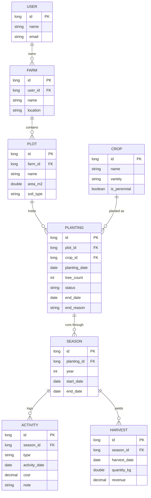

# Hệ thống Quản lý Canh tác Nông trại — Tài liệu Thiết kế

> Tài liệu này là **mốc khóa thiết kế (Phase 0)** của dự án. Nó ghi lại mục tiêu,
> phạm vi, các user story, mô hình dữ liệu (ERD) và những quyết định thiết kế quan
> trọng. Đặt file này tại `docs/design.md` trong repo.

---

## 1. Tổng quan

Hệ thống giúp chủ nông trại số hóa việc quản lý canh tác: theo dõi từng lô đất,
từng lứa cây trồng (kể cả trồng xen nhiều loại trên một lô), ghi nhật ký các hoạt
động chăm sóc và chi phí, ghi nhận sản lượng — doanh thu qua từng năm, và tính được
**lãi/lỗ riêng cho từng loại cây**.

Bối cảnh thực tế lấy từ mô hình canh tác vùng Tây Nguyên/Đông Nam Bộ: các hộ trồng
**xen canh cây lâu năm** (cà phê, hồ tiêu, cao su, sầu riêng, điều) và **đổi phương
án canh tác** khi giá thị trường biến động hoặc khi sâu bệnh/thời tiết gây thiệt hại.

### Mục tiêu
- Quản lý tập trung nhiều nông trại, lô đất và cây trồng.
- Ghi nhật ký canh tác đầy đủ, có thể truy xuất lịch sử sử dụng đất.
- Phân tích hiệu quả kinh tế theo từng loại cây và từng năm.

---

## 2. Phạm vi

| Nhóm chức năng | Phase |
|---|---|
| Quản lý nông trại, lô đất, cây trồng, lứa trồng (CRUD) | MVP |
| Nhật ký hoạt động canh tác + chi phí | MVP |
| Ghi nhận thu hoạch (sản lượng, doanh thu) | MVP |
| Vòng đời lứa trồng (cưa bỏ / trồng lại, lý do) | MVP |
| Báo cáo lãi/lỗ theo lô, theo cây, theo năm | Phase 2 |
| Engine nhắc việc chăm sóc theo giai đoạn | Phase 2 |
| Chất lượng: validation, xử lý ngoại lệ, test, tài liệu API | Phase 3 |
| Frontend + Docker + deploy | Phase 4 |
| Xác thực JWT, truy xuất nguồn gốc, giá thị trường, phân quyền công nhân | Phase 5+ |

---

## 3. Vai trò (Actors)

- **Chủ nông trại** — vai trò chính cho MVP; quản lý toàn bộ dữ liệu của mình.
- **Công nhân** — dự kiến Phase 5 (khi làm phân quyền); ghi nhật ký hoạt động.

---

## 4. User Stories

Mẫu: *Là [vai trò], tôi muốn [hành động], để [lợi ích].*

### Epic A — Quản lý nông trại & lô đất `[MVP]`
- Là chủ nông trại, tôi muốn tạo/sửa/xóa thông tin nông trại, để quản lý tập trung
  nhiều nông trại ở một nơi.
- Là chủ nông trại, tôi muốn thêm lô đất (diện tích, loại đất) vào một nông trại, để
  theo dõi riêng từng khu vực canh tác.

### Epic B — Quản lý lứa trồng (xen canh) `[MVP]`
- Là chủ nông trại, tôi muốn trồng một loại cây trên một lô đất kèm ngày trồng, để bắt
  đầu theo dõi lứa cây đó.
- Là chủ nông trại, tôi muốn trồng nhiều loại cây khác nhau trên cùng một lô, để phản
  ánh đúng thực tế xen canh.
- Là chủ nông trại, tôi muốn xem hiện lô đất đang có những cây gì đang sống, để nắm
  tình trạng sử dụng đất.

### Epic C — Vòng đời lứa trồng `[MVP]`
- Là chủ nông trại, tôi muốn đánh dấu một lứa trồng đã kết thúc (cưa bỏ) kèm ngày và
  lý do, để lưu lại lịch sử và giải phóng lô đất cho lứa mới.

### Epic D — Nhật ký canh tác `[MVP]`
- Là chủ nông trại, tôi muốn ghi lại các hoạt động (tưới, bón phân, phun thuốc, làm cỏ,
  tỉa cành) kèm ngày và chi phí, để có nhật ký đầy đủ cho từng lứa cây.

### Epic E — Thu hoạch & phân tích `[MVP / Phase 2]`
- Là chủ nông trại, tôi muốn ghi nhận sản lượng và doanh thu mỗi lần thu hoạch, để
  đánh giá kết quả. `[MVP]`
- Là chủ nông trại, tôi muốn xem báo cáo lãi/lỗ theo từng cây và từng năm, để biết nơi
  nào canh tác hiệu quả. `[Phase 2]`

### Epic F — Nhắc việc thông minh `[Phase 2]`
- Là chủ nông trại, tôi muốn hệ thống tự nhắc các việc chăm sóc theo giai đoạn của cây,
  để không bỏ lỡ thời điểm quan trọng.

### Ví dụ tiêu chí chấp nhận (Given / When / Then)
> **Story:** "…thêm lô đất vào một nông trại."
> - **Given** tôi đang ở một nông trại đã tồn tại, **When** tôi thêm lô đất với diện
>   tích hợp lệ (> 0), **Then** lô đất được lưu và hiện trong danh sách của nông trại.
> - **Given** tôi nhập diện tích ≤ 0 hoặc bỏ trống tên lô, **When** tôi lưu, **Then**
>   hệ thống báo lỗi validation và không lưu.

---

## 5. Sơ đồ ERD

> **Ghi chú phạm vi:** Tầng `SEASON` (niên vụ) cho phép so sánh năng suất qua từng năm
> — rất giá trị với cây lâu năm. Phương án gọn hơn là bỏ `SEASON` rồi nhóm `ACTIVITY`/
> `HARVEST` theo `YEAR(ngày)`, nhưng niên vụ cà phê chạy từ tháng 2 năm này tới tháng 1
> năm sau nên cách nhóm đó cắt đôi vụ thu hoạch và ghép sai chi phí với doanh thu.
>
> **Đã chốt ở M3:** giữ `SEASON`, và niên vụ là **dữ liệu dẫn xuất** — người dùng ghi
> hoạt động/thu hoạch vào *lứa trồng* kèm ngày, hệ thống tự tính niên vụ chứa ngày đó từ
> `CROP.season_start_month` và tạo nếu chưa có. API không có `POST`/`PUT` niên vụ.
> Xem BR-05a và ADR-7 trong `architecture.md`.

---

## 6. Từ điển dữ liệu

### USER — người dùng (chủ nông trại)
| Cột | Kiểu | Ghi chú |
|---|---|---|
| id | long | Khóa chính |
| name | string | Tên người dùng |
| email | string | Dùng cho đăng nhập ở Phase 5 |

### FARM — nông trại
| Cột | Kiểu | Ghi chú |
|---|---|---|
| id | long | Khóa chính |
| user_id | long | FK → USER (chủ sở hữu) |
| name | string | Tên nông trại |
| location | string | Địa điểm |

### PLOT — lô đất
| Cột | Kiểu | Ghi chú |
|---|---|---|
| id | long | Khóa chính |
| farm_id | long | FK → FARM |
| name | string | Tên/mã lô |
| area_m2 | double | Diện tích (m²), phải > 0 |
| soil_type | string | Loại đất |

### CROP — loại cây trồng (danh mục)
| Cột | Kiểu | Ghi chú |
|---|---|---|
| id | long | Khóa chính |
| name | string | Tên cây (cà phê, hồ tiêu, sầu riêng…) |
| variety | string | Giống |
| is_perennial | boolean | `true` = cây lâu năm; `false` = cây ngắn ngày |

### PLANTING — lứa trồng (một cây trên một lô, tại một thời điểm)
| Cột | Kiểu | Ghi chú |
|---|---|---|
| id | long | Khóa chính |
| plot_id | long | FK → PLOT |
| crop_id | long | FK → CROP |
| planting_date | date | Ngày trồng |
| tree_count | int | Số cây |
| status | enum | `GROWING`, `PRODUCING`, `TERMINATED` |
| end_date | date | Ngày kết thúc/cưa bỏ (null nếu đang sống) |
| end_reason | enum | `MARKET`, `PEST_DISEASE`, `WEATHER`, `OLD_AGE`, `OTHER` (null nếu chưa kết thúc) |

> Một `PLOT` có nhiều `PLANTING` → hỗ trợ **xen canh** và lưu **lịch sử sử dụng đất**.

### SEASON — niên vụ (một năm sản xuất của một lứa trồng)
| Cột | Kiểu | Ghi chú |
|---|---|---|
| id | long | Khóa chính |
| planting_id | long | FK → PLANTING |
| year | int | Năm **bắt đầu** niên vụ; duy nhất trong một lứa trồng (BR-05). Vụ 2/2025–1/2026 là `year = 2025` |
| start_date | date | Bắt đầu niên vụ; không trước ngày trồng |
| end_date | date | Kết thúc niên vụ; `null` = đang diễn ra (cây ngắn ngày) |

> Cây ngắn ngày: một lứa trồng ≈ một niên vụ. Cây lâu năm: một lứa trồng có nhiều niên vụ.
> Bản ghi do hệ thống sinh ra khi có hoạt động/thu hoạch đầu tiên rơi vào niên vụ đó.

### ACTIVITY — hoạt động canh tác
| Cột | Kiểu | Ghi chú |
|---|---|---|
| id | long | Khóa chính |
| season_id | long | FK → SEASON |
| type | enum | `WATERING`, `FERTILIZING`, `SPRAYING`, `WEEDING`, `PRUNING`, `OTHER` |
| activity_date | date | Ngày thực hiện; quyết định niên vụ của bản ghi (BR-05a) |
| cost | decimal | Chi phí (dùng `BigDecimal`, không dùng `double` cho tiền); bỏ trống = 0 |
| note | string | Ghi chú; **bắt buộc** khi `type = OTHER`, nếu không dòng nhật ký mất ý nghĩa (BR-12) |

### HARVEST — thu hoạch
| Cột | Kiểu | Ghi chú |
|---|---|---|
| id | long | Khóa chính |
| season_id | long | FK → SEASON |
| harvest_date | date | Ngày thu hoạch; quyết định niên vụ của bản ghi (BR-05a) |
| quantity_kg | double | Sản lượng (kg), phải > 0 |
| revenue | decimal | Doanh thu (`BigDecimal`) |

---

## 7. Quyết định thiết kế & lý do

Đây là những điểm cần giải thích được khi phỏng vấn.

1. **Xen canh xử lý bằng chuẩn hóa, không bằng cấu trúc đặc biệt.** Cho `PLOT` chứa
   nhiều `PLANTING` là đủ để một lô có nhiều loại cây cùng lúc. Thiết kế 3NF hỗ trợ
   nghiệp vụ này một cách tự nhiên.
2. **Tách lứa trồng khỏi vụ mùa để đúng bản chất cây lâu năm.** `PLANTING` là lần
   trồng (sống nhiều năm), `SEASON` là năm sản xuất. Một cấu trúc dùng chung cho cả cây
   ngắn ngày lẫn cây lâu năm.
3. **Chi phí và doanh thu gắn theo lứa trồng → tính lãi/lỗ từng cây dù trồng xen** trên
   cùng mảnh đất — đúng bài toán thật của nhà nông.
4. **Vòng đời lứa trồng bằng thuộc tính, không phải phẫu thuật cấu trúc.** Khi có yêu
   cầu mới (cưa bỏ, đổi cây do giá/sâu bệnh/thời tiết), chỉ cần thêm `end_date`,
   `end_reason`, `status` — ERD không đổi.
5. **Enum thay cho chuỗi tự do** (`status`, `end_reason`, `type`) để đảm bảo toàn vẹn
   dữ liệu.
6. **`BigDecimal` cho tiền tệ**, tránh sai số làm tròn của `double`.

---

## 8. Ý tưởng tương lai (không thuộc MVP)

Chủ động hoãn lại để ưu tiên ship MVP chất lượng cao:
- Chi tiết vật tư đầu vào (kg phân, lít thuốc) và tách chi phí công lao động / vật tư.
- Bảng `MarketPrice` — giá thị trường theo ngày, gợi ý lãi/lỗ so với giá hiện hành.
- Đính kèm ảnh cho truy xuất nguồn gốc nông sản.
- Nhận dữ liệu cảm biến IoT (giả lập): độ ẩm đất, nhiệt độ.
- Phân quyền công nhân (Phase 5).

---

## 9. Công nghệ dự kiến

- **Backend:** Java, Spring Boot, Spring Data JPA (Hibernate)
- **Database:** PostgreSQL
- **Tài liệu API:** Swagger / OpenAPI
- **Kiểm thử:** JUnit 5, Mockito
- **Đóng gói & triển khai:** Docker, free tier (Render / Railway / Fly.io), DB online (Neon / Supabase)
- **Frontend:** React + Tailwind CSS
- **Quản lý mã nguồn:** Git / GitHub

---

## 10. Điểm luyện tập kỹ thuật đáng chú ý

- **Vấn đề N+1 query** trên chuỗi `Plot → Planting → Season → Harvest`: luyện
  `JOIN FETCH`, `@EntityGraph`, `@BatchSize`.
- Kiến trúc phân tầng: Controller → Service → Repository, dùng DTO.
- Constructor Injection làm chuẩn.
- `ddl-auto=validate` cho môi trường production.
